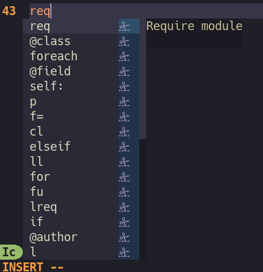

# incomplete.nvim

.

This small plugin for Neovim allows using `vim.opt.completefunc` to serve, expand and browse snippets.

## Usage

Just set your complete function to the one exposed in this plugin:

```lua
vim.o.completefunc = "v:lua.require'incomplete'.completefunc"
```

It can also be buffer-local.

After that, try opening your completefunc (`CTRL-X CTRL-U`) and using it as usual (type to filter, `CTRL-n`,`CTRL-p` to
scroll, `CTRL-y` to select). See `help completefunc`.

Some completeopts may be useful. E.g.:

```lua
vim.opt.shortmess:append("c")
vim.opt.completeopt = { "menuone", "popup", "noinsert", "noselect", "fuzzy" }
```

## Extending filetypes

In order to load snippets from additional filetypes (e.g. frameworks) in the original filetype, use `extend_filetype` function.
For example, the below will cause the following snippets to be loaded for the `php` filetype: `php`, `all`, `phpdoc`.

> [!NOTE]
> Calling this more than once for the same filetype will overwrite whatever was provided in the previous call.

```lua
require('incomplete').extend_filetype("php", {"phpdoc"})
```

## Autocompletion

Works with vim/nvim autocompletion. Example:

```lua
-- 'F' is the important part, it includes completefunc as a completion source
vim.o.complete = "o,.,w,b,u,F"
```

But snippets respond the quickest almost always, so they're always on the top of the list. I find this annoying and
don't use `F` source in autocompletion. Instead, I request snippets manually via `Ctrl-x Ctrl-u`.

## Adding snippets

Only vscode-like json snippets are supported, they must be placed in a `snippets/` folder at the root of your
runtimepath (e.g. at `$XDG_CONFIG_HOME/nvim/snippets`) with a `package.json` that contains metadata about all snippets.

Snippets for ft named `all` will be always loaded. Snippets for other fts will be loaded lazily only for that filetype.

See [Chris Grieser's nvim-scissors](https://github.com/chrisgrieser/nvim-scissors?tab=readme-ov-file#cookbook--faq) for a quick guide.

## Friendly Snippets

[friendly-snippets](https://github.com/rafamadriz/friendly-snippets) are supported.

Simply install them using your plugin manager, no need to call any lazy load etc. Incomplete.nvim will load snippets for
a given filetype automatically when opening such buffer.

## Reference

For reference usage, snippets etc. see [my neovim config](https://github.com/konradmalik/neovim-flake).
